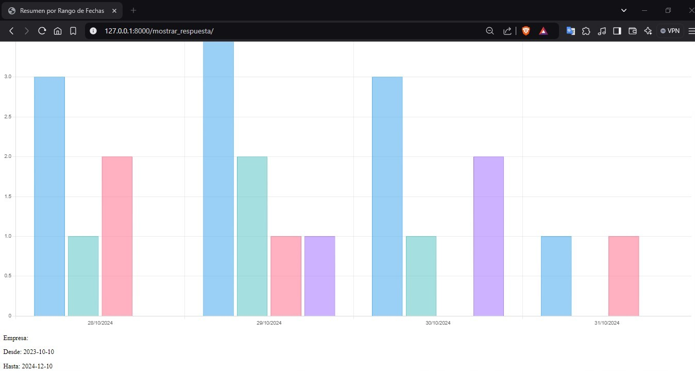

# ANÁLIZADOR DE MENSAJES 
## ENUNCIADO
La empresa Tecnologías Chapinas, S.A. ha creado una estrategia para establecer si un mensaje tiene un sentimiento positivo, negativo o neutro a través de la creación de un diccionario de datos que determine palabras que puedan calificar un mensaje como positivo o negativo, en caso de no tener palabras del diccionario de datos específico, o bien, que la cantidad de palabras con sentimientos positivos y negativos sean iguales, entonces, se considera que el mensaje es neutro. En este mismo diccionario de datos, es posible determinar los nombres de las empresas y sus servicios que se están analizando para determinar si en un momento dado, las redes sociales están mostrando un sentimiento positivo o negativo del mismo. El programa por desarrollar, luego de recibir el mensaje antes mencionado, deberá almacenar la información necesaria en formato XML, que constituirá la base de datos de la aplicación, para posteriormente emitir reportes y realizar consultas.
# MANUAL DE USUARIO
## FRONTEND
Algunas de las tecnologías utilizadas para la implementación del frontend son:
### DJANGO:
Django es un framework web de Python, lo que significa que es una estructura preconstruida que proporciona las bases para desarrollar aplicaciones web de manera organizada y escalable. Pensado para facilitar el desarrollo, Django ofrece una serie de herramientas y componentes que se encargan de las tareas más comunes, permitiéndo una mejor concentración en la lógica específica de un proyecto.
### CSS: 
fue utilizada para poder generar un estilo y mejoras visuales a la página html.
### HTML:
fue la base para la construcción de la página, desde las barras de navegación, tablas, imágenes, etc.
### MANUAL DE USO
Levantar el servidor Django
Para levantar el servidor es necesario correr el siguiente código:
#### Desde la raíz del archivo
##### cd frontend
##### python manage.py runserver
#### Correr servidor API
Desde la raíz, se corre el siguiente código:
##### flask run
## RECORRIDO DE LA PAGINA
En la pagina de inicio están presentes las siguientes opciones:
* Elegir archivo
* Enviar
* peticiones 
* Ayuda
### Elegir Archivos 
Este apartado,se desplegará una pantalla para gestionar la carga de los archivos de entrada con extensión .xml con una o varias solicitudes de clasificación. Se especifica en la sección de archivos de entrada y salida.

### Botón Enviar
Enviará las solicitudes de clasificación del recuadro de texto a la Api para su procesamiento. Botón Reset: Este botón mandará la instrucción a la Api para devolver al estado inicial la Base de Datos, es decir, sin datos.

### Peticiones 
En este apartado se debe de tener las siguientes opciones:

### Consultar Datos 
Al seleccionar esta opción se deben de consultar los datos almacenados en el último archivo de respuesta y se mostrarán los datos en un recuadro de texto de salida.

### Resumen de clasificación por fecha 
Al seleccionar esta opción se podrá elegir la fecha por la cual se requiere filtrar y si se desea incluir una empresa o todas las empresas, entonces se debe de mostrar gráficamente un resumen de mensajes clasificados. Debe presentar el total de mensajes, el total de mensajes positivos, el total de mensajes negativos y el total de mensajes neutros para la fecha y empresa seleccionados.

### Resumen por rango de fechas 
Al seleccionar esta opción se podrá elegir un rango de fechas por la cual se requiere filtrar, luego podrá elegir si desea ver una empresa o todas las empresas. Se deberá presentar gráficamente por cada fecha y empresa el total de mensajes, el total de mensajes positivos, el total de mensajes negativos y el total de mensajes neutros.

### Reporte en PDF 
Deberá ser posible realizar un reporte de todas las peticiones anteriormente descritas de forma detallada, es decir, incluir los datos de mensajes totales, mensajes positivos, mensajes negativos y mensajes neutros por empresa y servicio.

### Ayuda 
desplegará 2 opciones, una para visualizar información del estudiante y otra para visualizar la documentación del programa.

### Documentación

# BACKEND
Este servicio consiste en una API que brindará servicios utilizando el protocolo HTTP, su funcionalidad principal es procesar los datos recibidos del programa 1 (FRONTEND), luego de procesar los datos es necesario que estos sean almacenados en uno o varios archivos xml, algunos de estos archivos están especificados en la sección de archivos de entrada y salida1, este servicio también tiene la funcionalidad de devolver los datos que fueron almacenados para que sean mostrados como se indica en la sección “Programa 1 – Frontend / Componentes”.
Para la realización de este servicio se utilizó el framework Flask.Para que la aplicación funcionara de manera correcta fué necesario la creación de un entorno virtual, todo el codigo del backend se encuentra en el archivo app.py